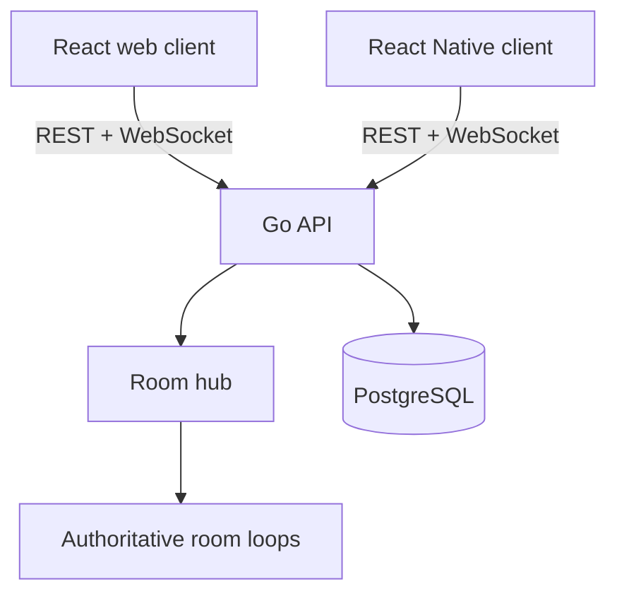

# System Architecture

| Component | Responsibility |
| --- | --- |
| Client | Render and collect controls |
| HTTP API | Players, rooms, progress, leaderboard |
| WebSocket API | Readiness, input, snapshots, results |
| Room | Validate input and calculate official state |
| PostgreSQL | Durable progress, matches, leaderboard |

## Decisions

- **Modular monolith:** one process is easier to test and deploy for the MVP.
- **In-memory room state:** fast match state belongs to its room; only durable results go to PostgreSQL.
- **Server authority:** clients send sequenced directional inputs. The server normalizes speed and calculates state.
- **No Redis yet:** introduce it only when several API instances require room routing or shared presence.
