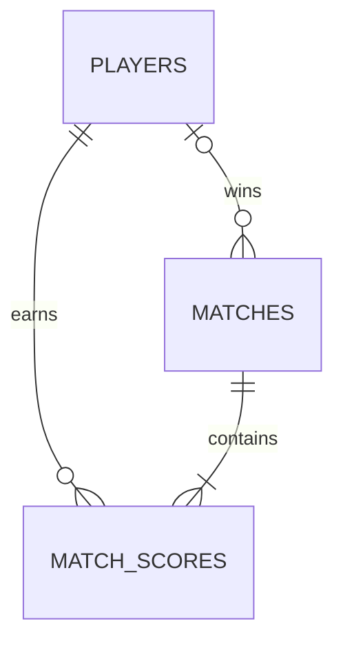

# Data Model

- `players`: identity, aggregate score, wins, and JSON progress.
- `matches`: room code, winner, and timestamps.
- `match_scores`: each player's score in a match.

Match saving uses one transaction so partial leaderboard updates cannot be committed.
